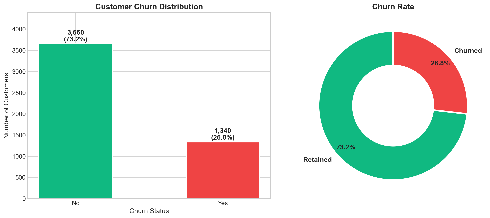
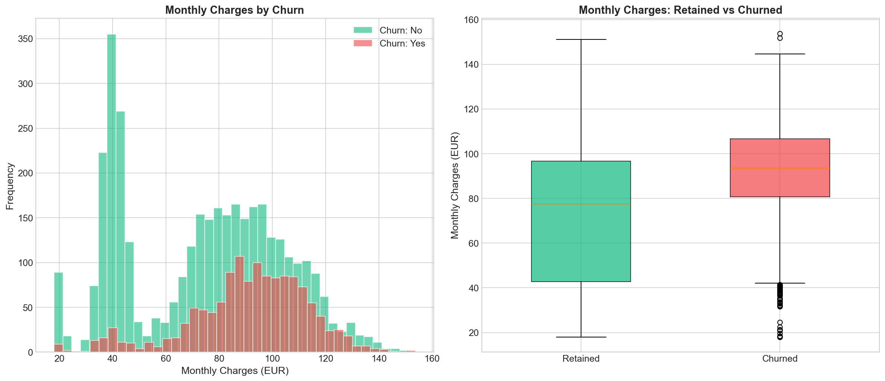
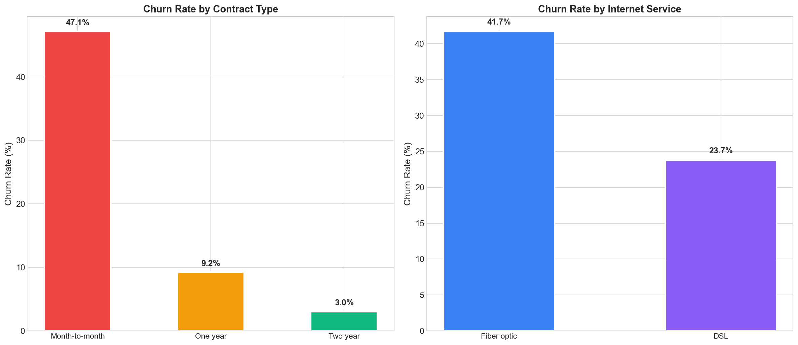
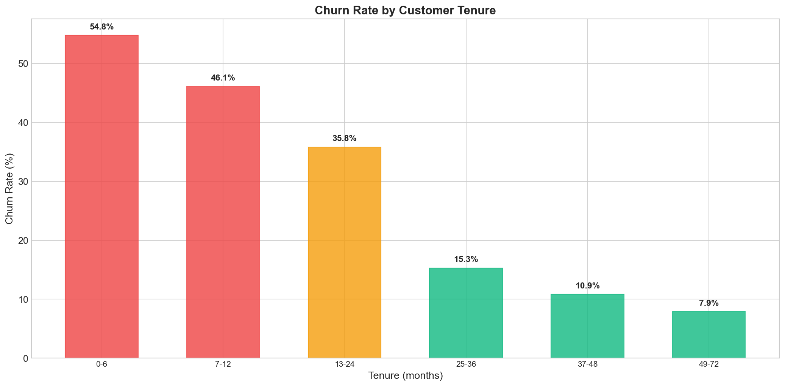
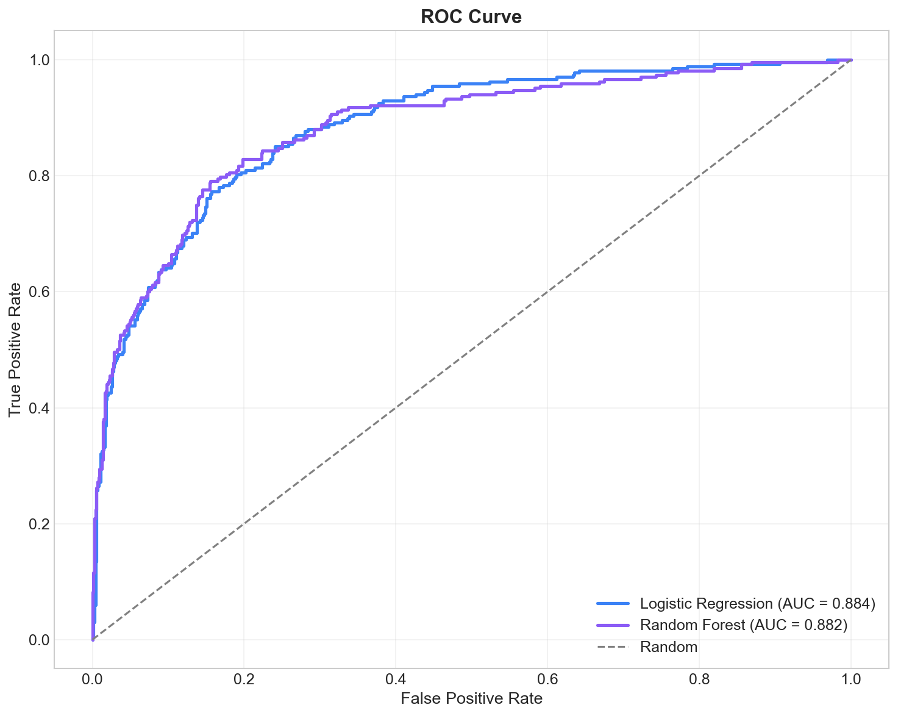
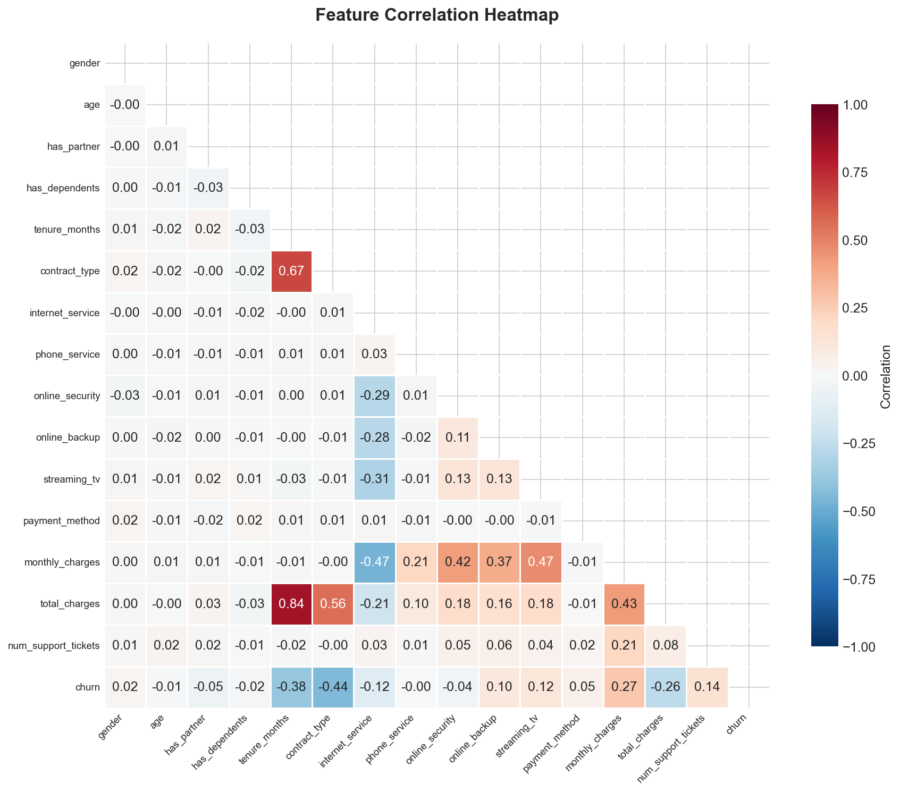
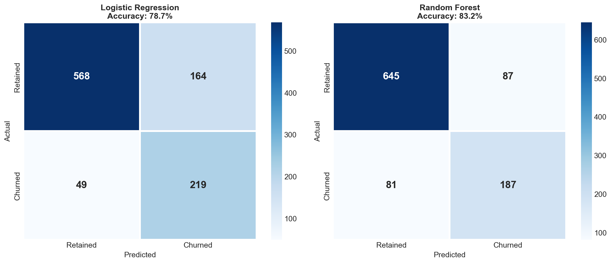

# Telecom Customer Churn Analysis

## Description
Analysis of telecom customer data to predict and understand customer churn using Machine Learning (Logistic Regression and Random Forest).

## Objectives
- Understand key factors driving customer churn
- Build predictive models to identify at-risk customers
- Provide data-driven business recommendations

## Technologies
- Python
- Pandas
- Scikit-learn
- Matplotlib
- Seaborn

## Results
| Model | Accuracy | AUC |
|-------|----------|-----|
| Logistic Regression | ~79% | ~0.82 |
| Random Forest | ~82% | ~0.85 |

## Visualizations

### Churn Distribution


### Monthly Charges vs Churn


### Churn by Contract Type


### Churn by Tenure


### Feature Importance


### ROC Curve


### Correlation Heatmap


### Confusion Matrix


## Installation
```bash
pip install -r requirements.txt
python generate_data.py
python analysis.py