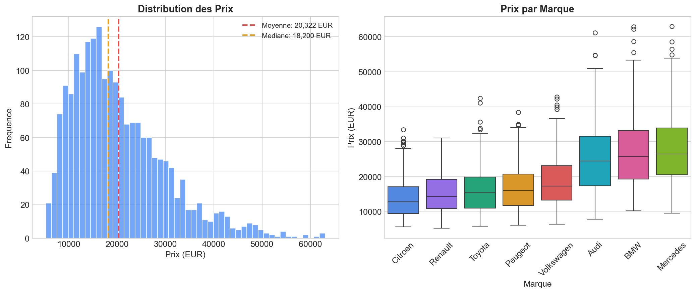
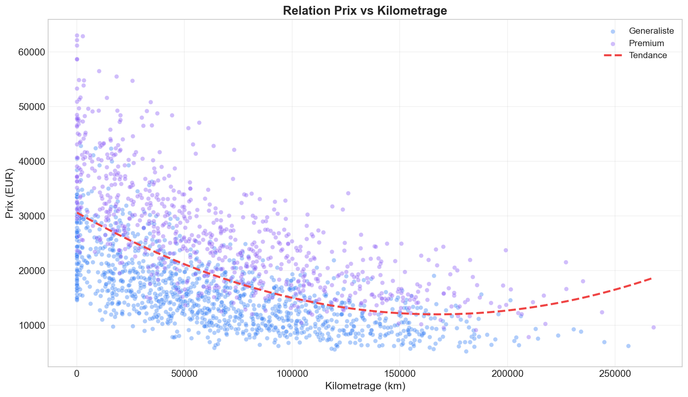
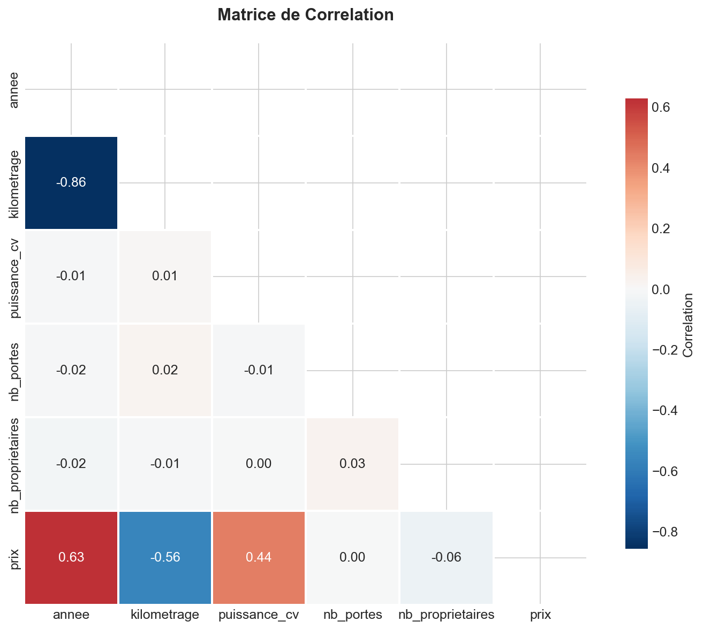
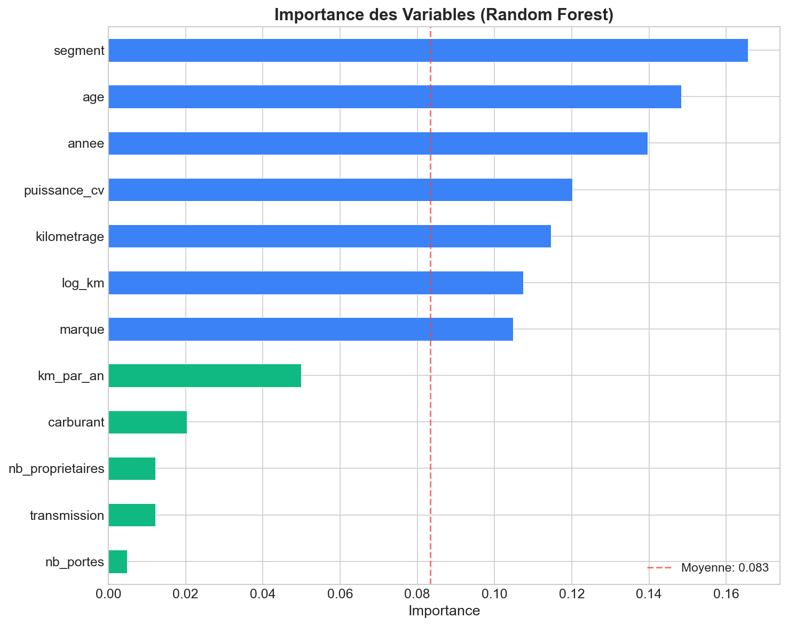
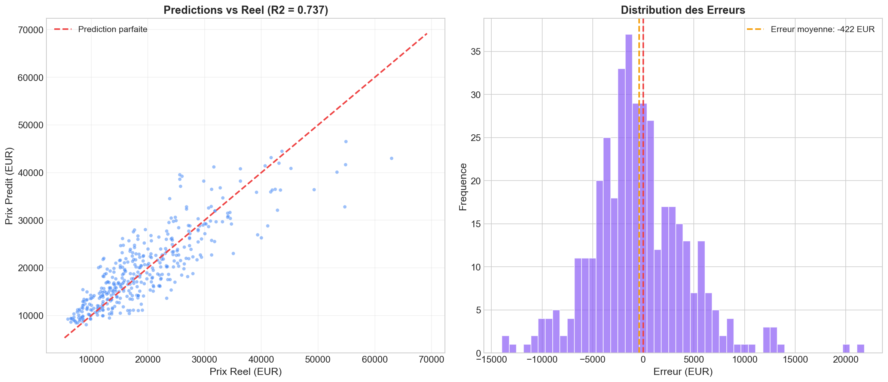

# Estimation du Prix de Vehicules d'Occasion

## Description
Modele de Machine Learning (Random Forest) pour estimer le prix de revente de vehicules d'occasion en France. Le modele prend en compte le kilometrage, l'age, la motorisation, la puissance et la marque pour predire la decote.

## Objectifs
- Analyser les facteurs influencant le prix des vehicules d'occasion
- Construire un modele predictif performant (Random Forest)
- Identifier les variables les plus impactantes (Feature Importance)
- Fournir un outil d'estimation fiable

## Dataset
Le dataset contient 2 000 vehicules avec les informations suivantes :
- Marque et modele (8 marques, 36 modeles)
- Annee de mise en circulation (2015-2024)
- Kilometrage
- Type de carburant (Essence, Diesel, Hybride, Electrique)
- Transmission (Manuelle, Automatique)
- Puissance (CV)
- Nombre de proprietaires

## Technologies
- Python
- Pandas (manipulation des donnees)
- NumPy (calculs numeriques)
- Scikit-learn (Machine Learning)
- Matplotlib (visualisations)
- Seaborn (visualisations statistiques)

## Resultats
| Metrique | Valeur |
|----------|--------|
| R2 Score | 0.74 |
| MAE | 3 592 EUR |
| RMSE | 4 765 EUR |
| MAPE | 20.3% |

## Visualisations

### Distribution des prix


### Prix vs Kilometrage


### Matrice de correlation


### Importance des variables


### Predictions vs Reel


## Installation
```bash
pip install -r requirements.txt
python generate_data.py
python analysis.py